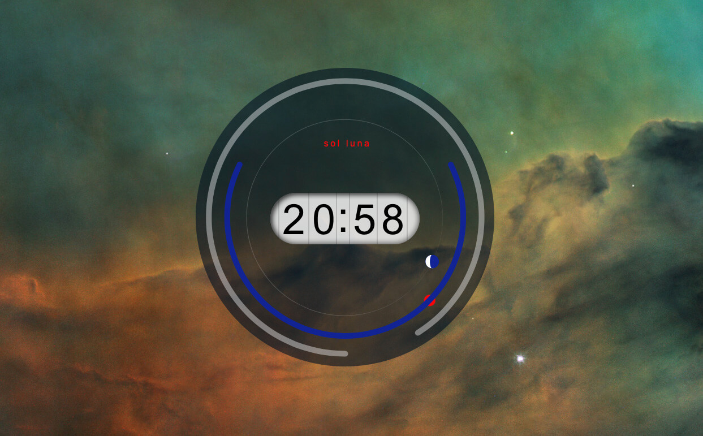

# sol_luna
sol luna
==========================

A clock for Übersicht.

[download Übersicht:](https://tracesof.net/uebersicht/)

features:
* time
* progress of year (outer circle)
* night time duration & sundial (inner circle)
* moon phases
* special events

settings:
* language (en/de)
* hide calendar
* hide special events
* change watch face title
* daylight saving
* daylight saving variables, depending your location
* refresh rate

styles:
* zoom
* position
* colors

TODOs:
* make it github ready : D
* add setting for calendrical or astronomical year progress circle (circle is full either on new years eve or around Dec. 21st)
* add on/off setting for clock animation
* ...

moon phase calculation by John Conway

more at [mrhide.de/nerd](https://mrhide.de/nerd)
